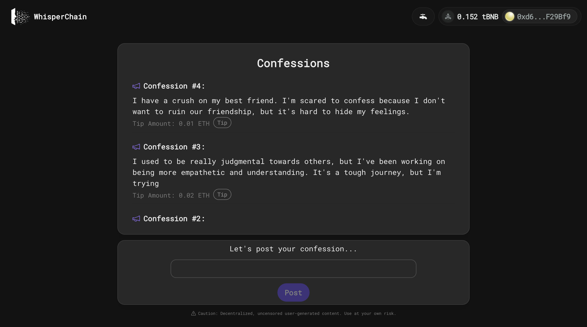

# Decentralized Confession Board - WhisperChain



## Description

WhisperChain is a blockchain-based platform for posting anonymous confessions, built with Solidity smart contracts and a React frontend. It ensures transparency and privacy, and includes a feature for users to tip their favorite confessions.

## Features

- **Anonymous Posting:** Users can post confessions without revealing their identity.
- **Binance Smart Chain Testnet Integration:** Utilizes Binance Smart Chain Testnet blockchain for storing confessions.
- **React Frontend:** A user-friendly interface built with React.
- **Smart Contract Functionality:** Powered by Solidity smart contracts.

## Technology Stack

- **Smart Contracts:** Solidity
- **Frontend:** React, HTML, CSS
- **Web3 Integration:** Wagmi, Web3Modal
- **Blockchain:** Binance Smart Chain Testnet

## Prerequisites

- npm or Yarn
- MetaMask extension installed in the browser

## Installation and Setup

1. **Clone the Repository:**

   ```bash
   git clone https://github.com/web3xDev/WhisperChain
   ```

2. **Install Dependencies:**

   ```bash
   yarn
   ```

3. **Deploy Confession.sol**

```
Deploy the smart contract(via Remix or Hardhat).
```

4. **Update .env.example**

   ```
   Update ".env.example" file with your values and change its name to ".env".
   ```

5. **Start the React App:**
   ```bash
   yarn dev
   ```

## Smart Contract Usage

- **Post a Confession:**
  ```solidity
  function postConfession(string memory _content) public;
  ```
- **Retrieve Confessions:**
  ```solidity
  function getAllConfessions() public view returns (Confession[] memory);
  ```
- **Tip Confession:**
  ```solidity
  function tipConfession(uint256 _id) public payable;
  ```

## Contributing

We welcome contributions to the WhisperChain!

## License

This project is licensed under the [MIT License](LICENSE).

## Contact

For support, feedback, or further queries, please contact me at //.
